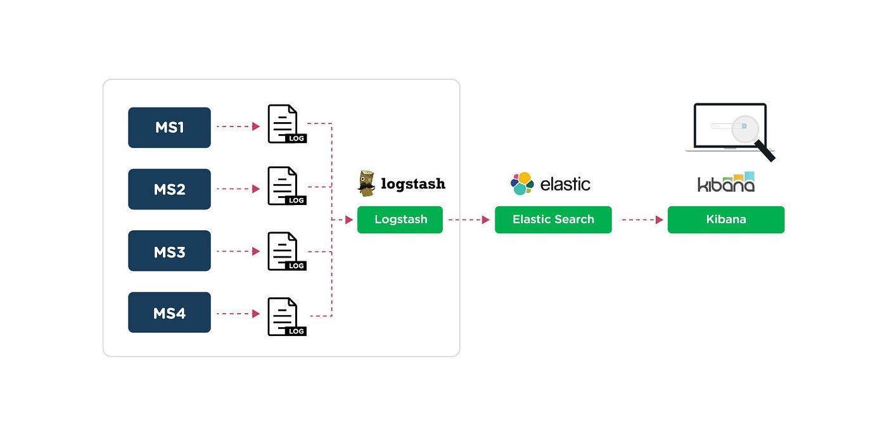

# 🛍️ Enterprise E-Commerce Microservices Platform

[](https://www.oracle.com/java/)
[](https://spring.io/projects/spring-boot)
[](https://reactjs.org/)
[](https://www.mongodb.com/)
[](https://redis.io/)
[](https://kafka.apache.org/)
[](https://www.docker.com/)
[](https://www.elastic.co/what-is/elk-stack)
[](LICENSE)


A modern, scalable e-commerce platform built with microservices architecture, demonstrating enterprise-grade software development practices and cloud-native design patterns. Features real-time updates through Kafka, comprehensive logging with ELK stack, and containerized deployment.

## 📸 Project Visuals

View the all project related  visuals including UI , architecture diagrams, and monitoring dashboards in [Project Images](https://github.com/Jeethanxx01/Microservice-E-commerce-platform/tree/main/Images).

## ✨ Key Features

- 🔐 **Secure Authentication & Authorization**
  - JWT-based authentication
  - Role-based access control
  - Enhanced logging for authentication events

- 🛍️ **Product Management**
  - Real-time inventory tracking via Kafka
  - search and filtering
  - Category management
  - Asynchronous updates for inventory changes

- 💳 **Order Processing**
  - Multi-step checkout
  - Order history and tracking
  - Asynchronous order status updates

## 🏗️ Architecture

### Microservices Breakdown

1. **User Service** (`user-service/`)
   - User management and authentication
   - Profile management
   - Role-based permissions
   - Enhanced logging with ELK integration

2. **Product Service** (`product-service/`)
   - Product catalog management
   - Inventory tracking
   - Search and filtering
   - Kafka-based real-time updates

3. **Cart Service** (`cart_service/`)
   - Shopping cart management
   - Price calculations
   - Cart Caching on redis cloud

4. **Order Service** (`order-service/`)
   - Order processing
   - Kafka-based order status updates

### Technology Stack

#### Backend Services
- **Core Framework**: Spring Boot 3.1.0
- **API Gateway**: Spring Cloud Gateway
- **Service Discovery**: Eureka Server
- **Database**: 
  - MongoDB (Product & Order data)
  - MySQL (User data)
  - Redis ( Cart Caching)
- **Message Broker**: Apache Kafka
- **Security**: Spring Security, JWT
- **Documentation**: Swagger
- **Logging**: ELK Stack (Elasticsearch, Logstash, Kibana)
- **Logging Framework**: Logback with Logstash integration
- **Containerization**: Docker

#### Frontend
- **Framework**: React 18
- **State Management**: Redux Toolkit
- **UI Components**: Material-UI
- **Styling**: Tailwind CSS
- **API Client**: Axios
- **Routing**: React Router DOM

## 🚀 Getting Started

### Prerequisites
- Java 17 or higher
- Node.js 16 or higher
- Docker and Docker Compose
- MongoDB
- Redis
- Apache Kafka
- MySQL
- ELK Stack (Elasticsearch, Logstash, Kibana)

### Installation

1. **Clone the Repository**
   ```bash
   git clone https://github.com/your-username/ecommerce-microservices-platform.git
   cd ecommerce-microservices-platform/Microservices
   docker-compose up -d
   ```
   run all microservices in IDE

2. **Start Infrastructure Services**
   ```bash
   cd elk-docker-setup
   docker-compose up -d
   ```

4. **Start Frontend**
   ```bash
   cd Frontend
   npm start
   ```

## 🔄 Service Interaction Flows with Kafka

### Order Processing Flow

1.  **User** initiates the process by sending a request to the **CartService** to add an item.
2.  **User** proceeds to checkout, sending a request to the **CartService**.
3.  The **CartService** sends a request to the **OrderService** to place the order (via REST API).
4.  The **OrderService** saves the new order details to the **Order DB**.
5.  The **OrderService** publishes an "order-placed" event to **Kafka**.
6.  **Kafka** delivers the event to the **ProductService**, which consumes it.
7.  The **ProductService** updates the stock quantity for the item in the **Product DB**.

### Order Cancellation Flow

1.  **User** initiates the cancellation by sending a request to the **OrderService**.
2.  The **OrderService** updates the order status to 'cancelled' in the **Order DB**.
3.  The **OrderService** publishes an "order-cancelled" event to **Kafka**.
4.  **Kafka** delivers the event to the **ProductService**, which consumes it.
5.  The **ProductService** increments the stock quantity for the cancelled item in the **Product DB**.


## 📊 Monitoring and Logging

### ELK Stack Integration
- **Centralized Logging**: All microservices logs are collected and processed
- **Logstash Configuration**: Custom patterns for structured logging
- **Elasticsearch**: Efficient log storage and indexing
- **Kibana**: Real-time log visualization and analysis
- **Logback Integration**: Structured logging with Logstash appender



### Monitoring Features in kibana
- Real-time log streaming
- Custom dashboards for different services
- Authentication event tracking
- Performance metrics visualization
- Error tracking and alerting

## 🔧 Development


### 📈 Performance Optimizations recommendations

- Redis caching for frequently accessed data
- Asynchronous processing with Kafka
- Database indexing and query optimization
- CDN integration for static assets
- Load balancing and horizontal scaling
- Containerized deployment for consistent environments
- Optimized logging with Logback

## 🔐 Security Features

- JWT-based authentication
- Role-based access control
- HTTPS enforcement
- Input validation and sanitization
- CORS configuration
## 🤝 Contributing

1. Fork the repository
2. Create your feature branch (`git checkout -b feature/AmazingFeature`)
3. Commit your changes (`git commit -m 'Add some AmazingFeature'`)
4. Push to the branch (`git push origin feature/AmazingFeature`)
5. Open a Pull Request

## 📝 License

This project is licensed under the MIT License - see the [LICENSE](LICENSE) file for details.

## 👥 Authors

- **Jeethan Joel Crasta**-  [GitHub](https://github.com/Jeethanxx01)


⭐ Star this repository if you find it helpful!
